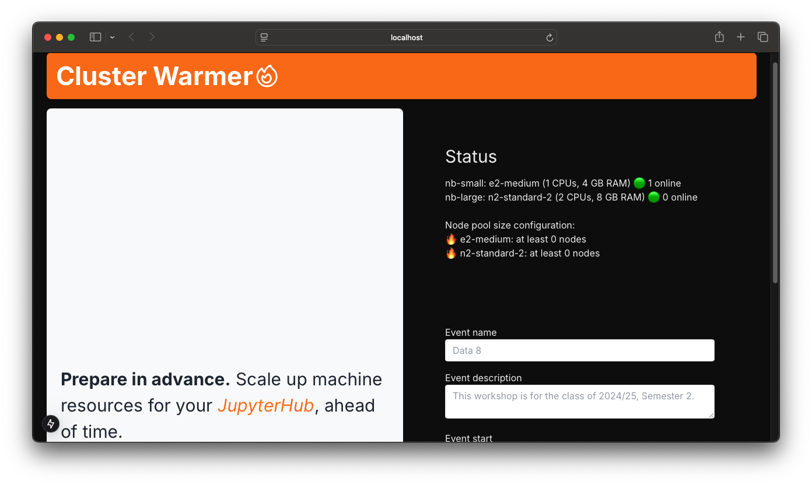

# Cluster Warmer 🔥



**Prepare in advance.** Scale up machine resources for your JupyterHub ahead of time.

## Requirements

Recommended: Python 3.12 and Node v22 (LTS).

### GKE authentication

Place the service account JSON key in the following location

```bash
.
├── LICENSE
├── README.md
├── backend
│   ├── core
├── ├── ├── service_account_key.json
├── ...
```

Update kubeconfig with

```bash
gcloud container clusters get-credentials $CLUSTER_NAME --location=$LOCATION
```

### Backend

We use Django for the backend.

Install Python packages with

```bash
pip install -r requirements.txt
```

We integrate a [Celery](https://docs.celeryq.dev/en/stable/index.html) task queue with Django to schedule cluster warming events. This requires running a message broker, such as RabbitMQ, which you can run in Docker with

```bash
docker run -d -p 5672:5672 rabbitmq  # detached mode
```

Run a Celery worker server with

```bash
celery -A core worker --beat --scheduler django -l INFO  # includes Celery beat
```

We communicate with the Kubernetes API using a proxy

```bash
$ kubectl proxy
Starting to serve on 127.0.0.1:8001
```

### Frontend

We use the Next.js framework for the frontend.

Switch to use Node v22.4.0 with

```bash
nvm use v22.4.0
```

and install packages with

```bash
cd frontend
npm run install
```

## Run a development server

### Backend server

Change directory

```bash
cd backend
```

where you can see two apps `core` and `web`, and `manage.py`

```bash
.
├── core
├── manage.py
└── web
```

When running for the first time, copy `core/local_settings.example.py` to `core/local_settings.py` – do not check this local version into version control. Use `local_settings.py` to provide specific/sensitive settings, such as the relative file location of the GKE service account key, etc.

Create the database, initialise it with GKE cluster information and (optionally) create a superuser admin account

```bash
python manage.py makemigrations
python manage.py migrate
python manage.py read_cluster
python manage.py createsuperuser
```

Run the development server at [http://127.0.0.1:8000/](http://127.0.0.1:8000/) with

```bash
python manage.py runserver
```

You can access the Django REST API at

```bash
http://127.0.0.1:8000/api/
```

Remember to have the following services running in separate Terminal windows/processes if you haven't already:

```bash
docker run -d -p 5672:5672 rabbitmq  # detached mode
```

```bash
celery -A core worker --beat --scheduler django -l INFO  # includes Celery beat
```

```bash
$ kubectl proxy
Starting to serve on 127.0.0.1:8001
```

### Frontend server

Change directory

```bash
cd frontend
```

and run the development server at [http://localhost:3000/](http://localhost:3000/) with

```bash
npm run dev
```
